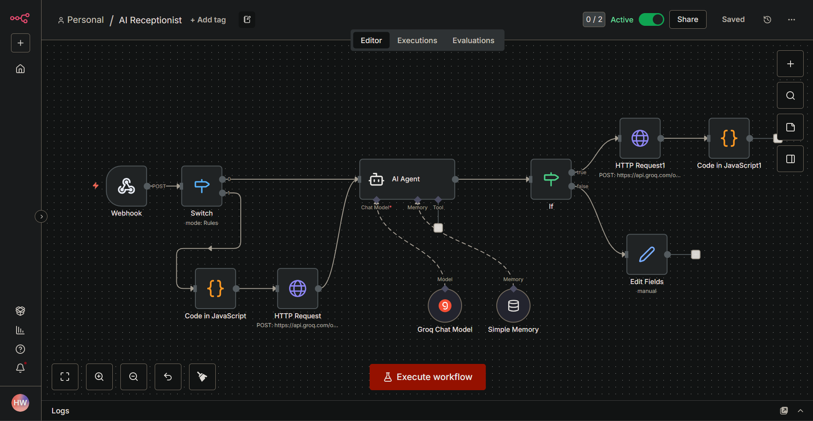

# AI Voice + Chat Receptionist

A real-time, voice-enabled AI receptionist built with n8n, Groq, and a custom React frontend. It qualifies leads through natural voice or text dialogue, maintains session memory across the conversation, and routes high-intent prospects to a booking page — all without human involvement.

---

## Demo

🎥 [Watch the full demo on YouTube](https://youtu.be/zaAxWv7ijQo?si=p9RNn9MEd3pTho68)

### Workflow Overview


---

## The Problem

Most lead capture tools rely on static forms or basic chatbots. Visitors find them impersonal and often leave before completing them. At the same time, sales teams end up in discovery calls with unqualified leads because standard forms don't ask the right questions.

---

## The Solution

A hands-free conversational AI that acts as the first point of contact. It doesn't just chat — it uses human-like voice interaction to build trust and qualify leads through natural dialogue before a human ever gets involved.

---

## How It Works

### 1. Omnichannel Input
The system accepts both text and voice via a custom React interface. Voice messages are transcribed in milliseconds using Groq's Whisper Large model.

### 2. Input Routing (Switch Node)
Incoming requests are routed based on input type:
- **Voice input** — passed through a JavaScript Code node for audio processing, then sent to Groq's STT API via HTTP Request before reaching the AI Agent
- **Text input** — sent directly to the AI Agent

### 3. AI Agent with Session Memory
The transcribed or typed message is sent to the AI Agent powered by the Groq Chat Model. The agent is equipped with Simple Memory, which persists the user's name and previous answers across the conversation, ensuring a seamless experience without repetitive questions.

### 4. Discovery Logic
Instead of a fixed form, the AI follows a dynamic qualification flow. It identifies the user's specific pain points, manual bottlenecks, and tech stack through conversation before offering a booking link.

### 5. Intent Routing (If Node)
Once the AI responds, an If node evaluates the lead's intent:
- **High intent** — the response is processed via HTTP Request to Groq's TTS API, converted to audio using the Orpheus model (WAV format), and streamed back to the frontend for near-zero latency playback. The Calendly booking link is surfaced.
- **Low intent** — the conversation continues or the lead is gracefully exited via the Edit Fields node.

### 6. Speech Synthesis
The AI's text response is converted back into human-like audio using Groq's Orpheus TTS and streamed to the React frontend for immediate playback.

---

## Tech Stack

| Layer | Tool |
|---|---|
| Workflow Automation | n8n |
| Speech to Text | Groq Whisper Large |
| AI Agent | Groq Chat Model (via n8n AI Agent node) |
| Text to Speech | Groq Orpheus TTS |
| Session Memory | n8n Simple Memory |
| Frontend | React (custom build) |
| Booking | Calendly |
| Audio Format | WAV |

---

## Workflow Nodes

| Node | Purpose |
|---|---|
| Webhook | Receives incoming text or voice input from the React frontend |
| Switch | Routes input based on type (voice vs text) |
| Code in JavaScript | Processes raw audio data before sending to STT |
| HTTP Request (STT) | Sends audio to Groq Whisper for transcription |
| AI Agent | Core conversational logic with memory and qualification |
| Groq Chat Model | Powers the AI Agent's responses |
| Simple Memory | Maintains session context across turns |
| If | Evaluates lead intent and routes accordingly |
| HTTP Request (TTS) | Sends AI text response to Groq Orpheus for speech synthesis |
| Code in JavaScript1 | Processes returned audio for frontend streaming |
| Edit Fields | Handles low-intent or exit paths |

---

## Setup Instructions

### Prerequisites
- n8n instance (self-hosted or cloud)
- Groq API key ([get one here](https://console.groq.com))
- React frontend (see frontend repo or configure your own)
- Calendly account with a booking link

### Step 1: Clone the Repository
```bash
git clone https://github.com/your-username/ai-voice-receptionist.git
cd ai-voice-receptionist
```

### Step 2: Import the Workflow
- Open your n8n instance
- Go to Workflows and click Import
- Upload the provided `workflow.json` file

### Step 3: Configure Credentials
In n8n, add the following credentials:
- **Groq API** — used for STT, Chat Model, and TTS nodes
- Set your Calendly booking URL inside the AI Agent system prompt

### Step 4: Set Up the Webhook
- Activate the workflow in n8n
- Copy the webhook URL generated by the Webhook node
- Paste it into your React frontend as the API endpoint

### Step 5: Run the Frontend
```bash
cd frontend
npm install
npm start
```

### Step 6: Test the Flow
- Open the React app in your browser
- Try both text and voice input
- Confirm the AI responds with audio and routes correctly based on intent

---

## Key Design Decisions

**Why Groq?** Groq's inference speed makes near-zero latency voice interaction possible. Standard OpenAI TTS/STT would introduce noticeable delays that break the conversational feel.

**Why session memory?** Without memory, the agent would re-introduce itself and re-ask questions on every turn. Simple Memory allows the conversation to feel continuous and human.

**Why a custom React frontend?** n8n has no native voice interface. Building a custom frontend allowed full control over audio recording, streaming playback, and UX design.

**Why the If node for routing?** Rather than always generating audio (expensive and slow for low-intent leads), the If node ensures TTS is only triggered when the conversation is progressing toward a booking.

---

## Screenshots

> Add additional UI screenshots of the React frontend here

---

## Future Improvements
- CRM integration to sync lead data and conversation summaries automatically
- Multi-language support using Groq's multilingual Whisper model
- Sentiment detection to adjust the agent's tone in real time
- Analytics dashboard to track qualification rates and drop-off points

---

## Author

**Hana Wubet**
[LinkedIn](#) | [GitHub](#) | hannwub12@gmail.com
